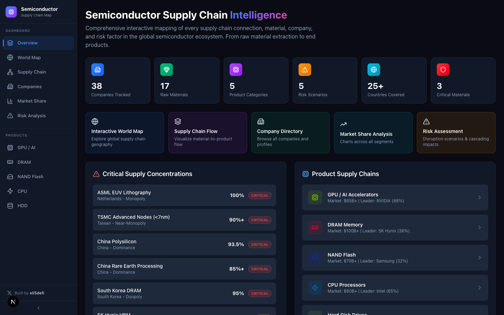

# Semiconductor Supply Chain Intelligence

Interactive dashboard mapping the global semiconductor supply chain — from raw materials to end products. Visualize geographic concentrations, market shares, risk scenarios, and cascading disruption impacts across the entire chip ecosystem.



## Features

- **Interactive World Map** — Leaflet-powered map with company HQs, fab locations, material sources, and trade routes. Search and fly-to any entity.
- **Supply Chain Flow** — Animated layer-by-layer visualization from raw materials → wafer fab → packaging → integration → end products.
- **Company Directory** — 38 tracked companies with financials, market caps, stock prices, employee counts, and segment breakdowns.
- **Market Share Analysis** — Pie/donut charts across GPU, DRAM, NAND, CPU, HDD, EDA, foundry, equipment, and more.
- **Risk Assessment** — Disruption scenarios (Taiwan, China export bans, HBM shortage, EUV), cascade timelines, geographic risk matrix.
- **Product Deep Dives** — GPU/AI, DRAM, NAND Flash, CPU, and HDD supply chains with bottleneck analysis.

## Tech Stack

- **Framework**: Next.js 16 (App Router)
- **Language**: TypeScript
- **Styling**: Tailwind CSS v4
- **Maps**: Leaflet + react-leaflet
- **Charts**: Recharts
- **Animations**: Framer Motion
- **Icons**: Lucide React

## Getting Started

```bash
npm install
npm run dev
```

Open [http://localhost:3000](http://localhost:3000) in your browser.

## Deploy

Deploy instantly on [Vercel](https://vercel.com):

[](https://vercel.com/new/clone?repository-url=https://github.com/Eli5DeFi/semiconductor-map)

## Author

Built by [eli5defi](https://x.com/Eli5defi)
